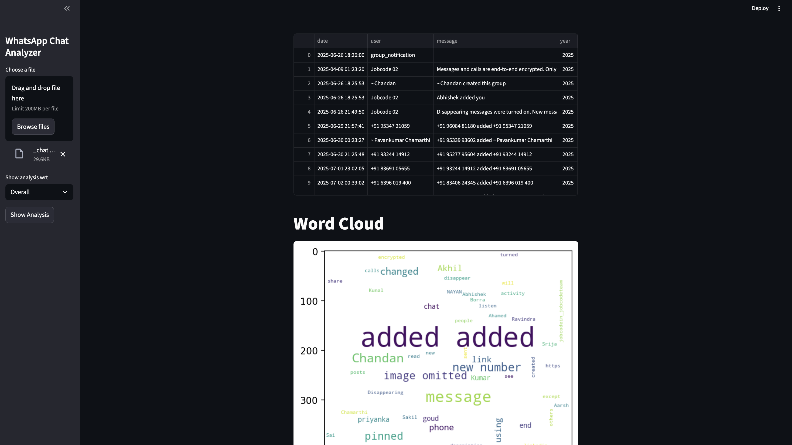

# 📊 WhatsApp Chat Analyzer

A powerful tool to analyze your **WhatsApp chat exports** and get detailed insights into your messaging behavior — with charts, word clouds, and activity summaries.

---

## 🚀 Overview
WhatsApp does not provide detailed analytics about your chats.  
This project helps you **analyze your exported WhatsApp chat files** (individual or group) and visualize interesting statistics such as message frequency, word count, emoji usage, and more.

---
[](https://youtu.be/ucagh9kYeR8)


---

## ✨ Features
- 📅 **Timeline Analysis** — View chat activity by day, month, or hour  
- 👥 **Participant Stats** — Identify who sends the most messages  
- 🗣️ **Word Frequency** — See your most used words  
- 😄 **Emoji Analysis** — Find your favorite emojis  
- 🔗 **Link & Media Count** — Count shared media and URLs  
- ☁️ **Word Cloud Visualization**  
- 🧠 Optional: Sentiment or emotion analysis (future update)

---
## 🧑‍💻 Tech Stack

- **Python**

- **Pandas, Matplotlib, Seaborn, WordCloud**

- **Streamlit (for visualization UI)**

---

## 📂 How It Works
1. **Export your chat from WhatsApp:**
   - Open a chat → Tap menu → **More → Export chat → Without media**
   - This creates a `.txt` file  
2. **Place the exported file** inside this project directory  
3. **Run the analyzer** to view detailed insights, stats, and graphs  

---
## 💡 Future Enhancements

- **📈 Sentiment analysis**

- **🔍 Message topic clustering**

- **📊 PDF or CSV report export**

- **🌐 Online hosted version for easier access**

- **🧩 Integration with Google Data Studio or Power BI**
---

## ⚙️ Installation
Make sure you have **Python 3.x** installed.

```bash
# Clone this repository
git clone https://github.com/kunal031/WhatsApp-Chat-Analyzer.git

# Move into the project folder
cd WhatsApp-Chat-Analyzer

# Install dependencies
pip install -r requirements.txt


